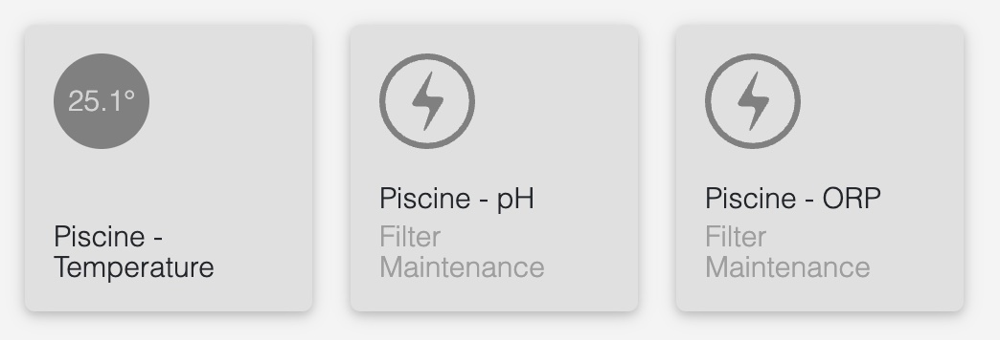

# homebridge-iopool

A small Homebridge plugin to monitor your swimming pool(s) using [iopool](https://iopool.com) product & service. This plugin monitor Temperature, pH, and ORP.



# Installation
This plugin needs Homebridge server installed, follow [Homebridge website](https://homebridge.io/) to install it.

Once Homebridge server installed, you can add this plugin from the server UI or using NPM command:
```bash
npm install -g homebridge-iopool
```

# Configuration
You need to configure the plugin before using it. Please see the config settings in the UI or update your config.json file in your server directory.

```json
"platforms": [
        ...,
        {
            "platform": "HomebridgeIopool",
            "name": "iopool",
            "token": "[YOUR IOPOOL TOKEN]",
            "delay": 15,
            "PhMin": 7.1,
            "PhMax": 7.7,
            "OrpMin": 650,
            "OrpMax": 800
        }
    ],
```
__Note:__ The token can be retrieved in the iopool mobile application.
